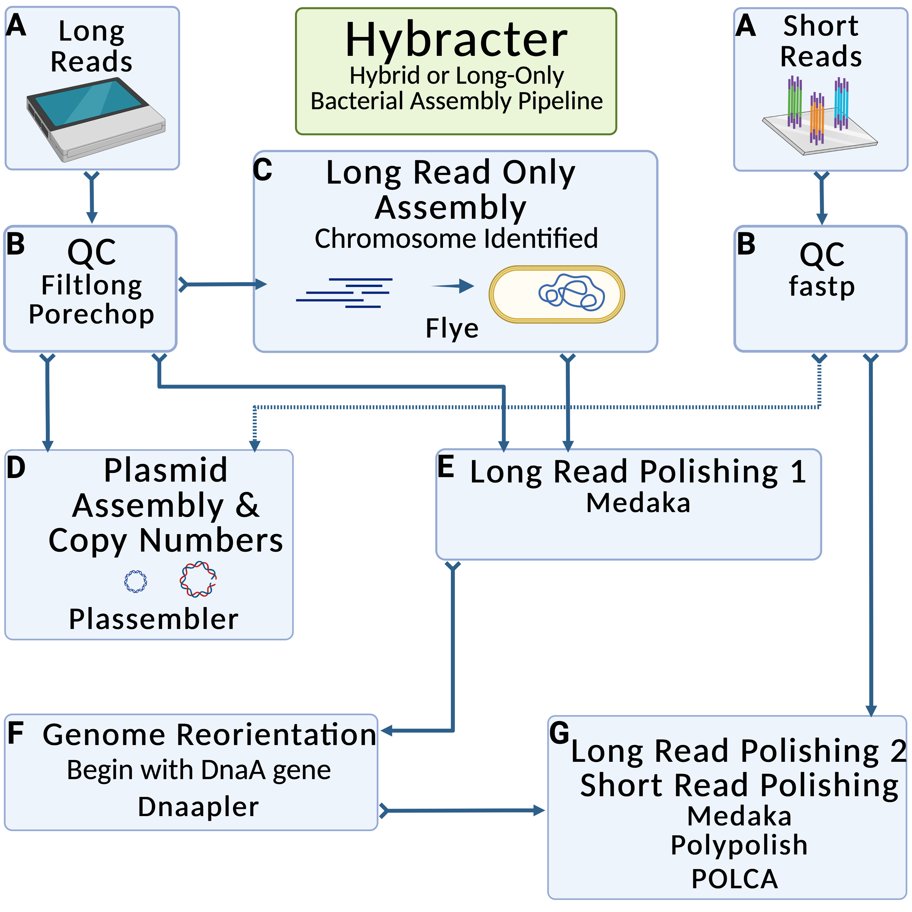

CRS_Saureus_Evolutionary_Landscape
====================================

Introduction
--------------------

This repository holds the code base for Houtak & Bouras et al, 'The Intra-Host Evolutionary Landscape And Pathoadaptation Of Persistent *Staphylococcus aureus* In Chronic Rhinosinusitis' published in _Microbial Genomics_ [here](https://doi.org/10.1099/mgen.0.001128).

This was a combined effort with [ghs101](https://github.com/ghs101), who lead the project. If you find any of this code useful for your research, feel free to copy, use or modify - but please cite the pre-print!

You will need to have conda & snakemake installed to run the bulk of the analysis - the conda environments in the snakemake pipelines should automatically install. I have not included detailed installation instructions for the miscellaneous scripts in the structural locus deep dive - the instructions are contained in the relevant shell scripts (simple conda environments are recommended). For R scripts, there are no installation instructions, but any package not found on CRAN or Bioconductor will have detailed installation instructions commented out (e.g. gggenomes) in the relevant script.

Table of Contents
-----------
- [CRS\_Saureus\_Evolutionary\_Landscape](#crs_saureus_evolutionary_landscape)
  - [Introduction](#introduction)
  - [Table of Contents](#table-of-contents)
  - [Assemblies](#assemblies)
  - [Chromosome Analysis](#chromosome-analysis)
  - [Chromosome - Other Miscellaneous Bioinformatics Scripts](#chromosome---other-miscellaneous-bioinformatics-scripts)
  - [Plasmid Snakemake Pipeline](#plasmid-snakemake-pipeline)
  - [Structural\_Locus\_Deep\_Dive](#structural_locus_deep_dive)
  - [R Scripts for Plotting etc](#r-scripts-for-plotting-etc)
  - [Metadata](#metadata)
  - [Codon Bias and GC Content](#codon-bias-and-gc-content)
  - [Citation](#citation)
  - [Issues](#issues)

Assemblies
-----------

<p align="center">
  
</p>


It is assumed you are using the assembled chromosome and plasmid assemblies that can be found in [PRJNA914892](https://www.ncbi.nlm.nih.gov/bioproject/914892) and also in this repository. A full list of isolates, Biosample numbers and associated metadata (particularly time-points), can be found in Supplementary Table 1.

If you would like to recreate the assemblies, they were created with a hybrid bacterial assembly pipleine that has been formalised in a [Snaketool](https://github.com/beardymcjohnface/Snaketool) powered command line tool called [hybracter](https://github.com/gbouras13/hybracter). Please see the hybracter [repository](https://github.com/gbouras13/hybracter) for more details.

Hybracter was run as follows:

```
hybracter run --input metadata.csv --output CRS_landscape_assemblies_out --threads 16
```

Where metadata.csv contains the paths to all 68 isolate long & short read FASTQ files as follows (2500000 being the lower bound for S aureus chromosome size):

C1,C1_long_read.fastq.gz,2500000,C1_short_R1.fastq.gz,C1_short_R2.fastq.gz

These can be downloaded from the SRA.

Chromosome Analysis
-----------

<p align="center">
  
</p>

The section forms the bulk of the analysis conducted for the manuscript. The Snakemake pipeline can be found in the Chromosome_Snakemake directory.

Before this, all chromosome assemblies were annotated with bakta (not included in this repository as the scripts are part of a larger project) using e.g. for C1, where C1.fasta is the chromosome assembly from hybracter:

```
bakta --db bakta_db --verbose --output C1 --prefix C1 --locus-tag C1 --threads 8 C1.fasta
```

All gff and gbk and FASTA files have been provided in this repository.

The following analyses were conducted:

1. [Snippy](https://github.com/tseemann/snippy) was run on the T1 isolate short reads vs the T0 isolate chromosome gbk for each pair to delete SNPs.
2. [Nucdiff](https://github.com/uio-cels/NucDiff) was run on the T1 isolate chromosome assembly  vs the T0 isolate chromosome assembly for each pair to detect strucutral variants.
3. [MLST](https://github.com/tseemann/mlst) was run on the T1 isolate chromosome assembly  vs the T0 isolate chromosome assembly for each pair.
4. [ISEScan](https://github.com/xiezhq/ISEScan) was run on all isolates.
5. [Panaroo](https://github.com/gtonkinhill/panaroo) was run on all isolates gff files to create a pan-genome.
6. [Abricate](https://github.com/tseemann/abricate) was run on all isolates to detect AMR and virulence factor genes.
7. [Sniffles](https://github.com/fritzsedlazeck/Sniffles) was run on the T1 long reads  vs the T0 isolate chromosome assembly for each pair to detect strucutral variants.
8. [PhiSpy](https://github.com/linsalrob/PhiSpy) was run on each chromosome assembly to predict prophages in each isolate.

Not all of these analyses made it into the paper in the end (namely PhiSpy and ISEScan).

To re-run these analyses, ensure you are in the Chromosome_Snakemake directory with Snakemake available (preferably in a conda environment) and make sure the paths to the long and short read FASTQ files (from the SRA) are changed in metadata.csv, then run:

```
snakemake -c <cores> -s runner.smk --use-conda   \
--config csv=metadata.csv Output=Snakemake_Output
```


Chromosome - Other Miscellaneous Bioinformatics Scripts
---------

There are a couple of other miscellaneous scripts that are not in the Snakemake pipeline (had some trouble with HPC installs!)

1. [Scoary](https://github.com/AdmiralenOla/Scoary) analysis can be found in the scoary directory - see run_scoary.sh, you will need to install panaroo and scoary.
2. [PopPUNK](https://poppunk.readthedocs.io/en/latest/) Analysis can be found in poppunk directory - see run_poppunk.sh. The s aureus reference database was taken from [here](https://www.bacpop.org/poppunk/). You will need to install poppunk.


Plasmid Snakemake Pipeline
---------

<p align="center">
  
</p>


The section forms the plasmid analysis conducted for the manuscript. The Snakemake pipeline can be found in the Plasmid_Snakemake directory.

All plasmids were assembled using [Plassembler](https://github.com/gbouras13/plassembler) v 0.1.4. You can see more details about Plassembler by following that link.

To run these analyses, please ensure you are in the Plasmid_Snakemake directory with Snakemake available (best as a conda environment) and run

```
snakemake -c 1 -s plasmid_runner.smk --use-conda   \
--config Input=../PLASMID_FASTAS Output=../Plasmid_Snakemake_Out
```

The following analyses were conducted:

1. [Bakta](https://github.com/oschwengers/bakta) was run to annotate all plasmids.
2. [Panaroo](https://github.com/gtonkinhill/panaroo) was run on all isolates gff files to create a pan-genome.
3. [Abricate](https://github.com/tseemann/abricate) was run on all plasmids to detect AMR and virulence factor genes.
4. [Mash](https://github.com/tseemann/mlst) distance matrix was calculated between all plasmid contigs.
5. Jaccard distances matrix was calculated between all plasmid contigs based on gene present absence.

Structural_Locus_Deep_Dive
-------------------

Arguably the nicest aspect of this manuscript :) - the deep dive into the structural changes in the sdrCDE locus of patient 420 and the beta-lactamase locus of patient 4875.

To re-create the gviz plots (From the Supplementary Figures), you will need to first download the relevant long read FASTQs off the SRA and move into the Structural_Locus_Deep_Dive/sdrd_blaz_gviz directory, and make sure [filtlong](https://github.com/rrwick/Filtlong), [minimap2](https://github.com/lh3/minimap2) and [samtools](https://github.com/samtools/samtools) are available (see map_reads.sh). Then you need to:

1. Run map_reads.sh
2. Run create_gviz_plots.R - the pileup plots were created with [gviz](https://bioconductor.org/packages/release/bioc/html/Gviz.html).

To re-create the gggenomes plots (Figure 2A, B), move into the Structural_Locus_Deep_Dive directory and then:

1. Run locus_extract.sh to extract the relevant regions. These have been included and annotated - you can use run_bakta.sh to do that again if you would like.
2. Run gggenomes.R - plots were created with [gggenomes](https://github.com/thackl/gggenomes) - I note this was a bit tricky to install.


R Scripts for Plotting etc
---------

Post processing was done in R and can be found in R/ directory.

The scripts do the following functions:

* snp_vs_struct_count.R - calculated the number of SNPs vs larger structural changes (Table 2).
* plasmid_blaz_determination.R - determine which plasmids carry beta-lactamase
* parse_snps_gffs.R - parsing Snippy output
* parse_nucdiff_gffs.R - parses nucdiff analysis
* mash_jaccard_plasmid_analysis.R and plasmid_heatmap.R - aggregated mash and Jaccard plasmid analysis, creates heatmap (Fig 3)
* biofilm_tolerance.R - Fig 5
* biomass.R - Fig 6
* heatmaps.R - Figs S1 and S2
* medication.R - Fig S6
* tree.R - Fig 1A
* snps.R - Fig 1B
* planktonic_graph.R - Fig S5
* plasmid_copy_numbers.R - plasmid copy number analysis Fig 4 & (Fig S4)
* biofilm_vs_copy_number.R - correlated bioliflm with plasmid copy number

Metadata
-----------

All metadata can be found in the metadata directory.

* biofilm_data.csv - biolfilm metabolic activity data
* poppunk_mlst.csv - summarised file of MLST and Poppunk clusters
* plassembler_copy_number.csv - summarised file of all plassembler copy numbers
* metadata_phylogentic_tree.csv - metadata for Figure 1A
* gess_time.csv - Links the host (patient) id with Time and isolate numbers.

Codon Bias and GC Content
-----------

Scripts (`calc_codon_bias.py` and `calc_gc.py`) that crudely estimate the ratio of non-synonymous to synonymous nucleotide changes and GC content for MSCRAMM and non-MSCRAMM genes are contained in the `mscramm_codon_bias` directory. These require `biopython` to be installed (`conda install biopython`).

Citation
------------

The Intra-Host Evolutionary Landscape And Pathoadaptation Of Persistent Staphylococcus aureus In Chronic Rhinosinusitis
Ghais Houtak, George Bouras, Roshan Nepal, Gohar Shaghayegh, Clare Cooksley, Alkis James Psaltis, Peter-John Wormald, Sarah Vreugde
_Microbial Genomics_ (2023) Volume 9, Issue 11; doi: [https://doi.org/10.1099/mgen.0.001128](https://doi.org/10.1099/mgen.0.001128).

Issues
-----------

If you want some more clarification on some of these scripts (particularly if anything doesn't work - quite likely!) please raise an issue.
